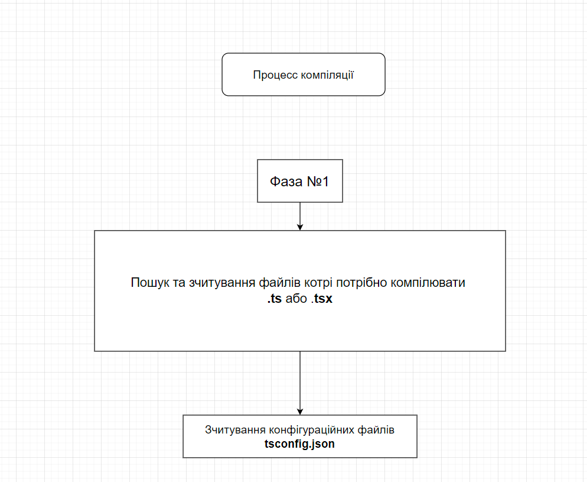
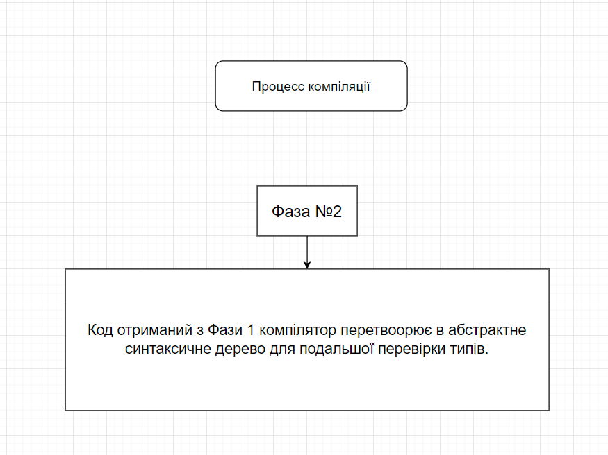
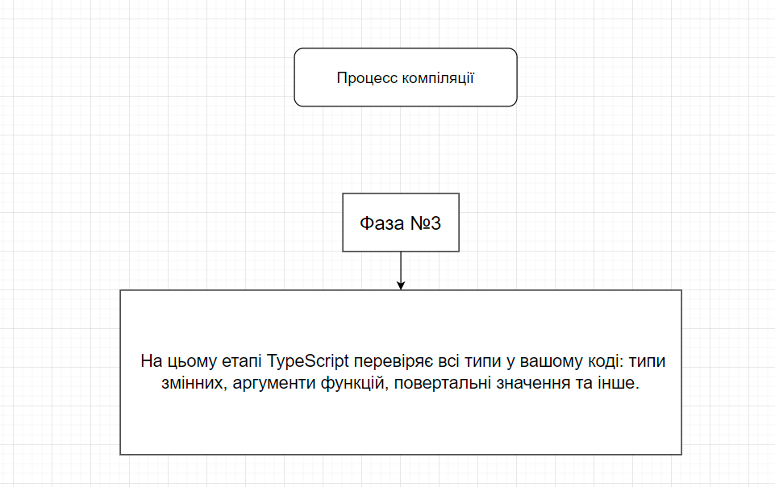
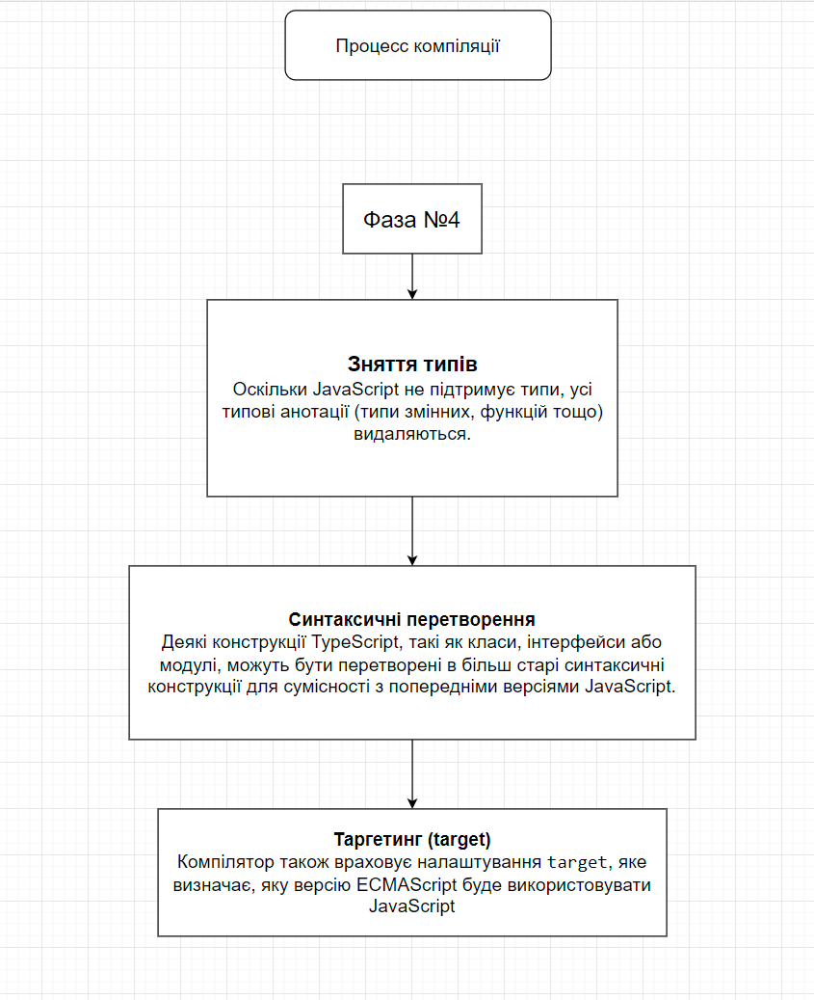
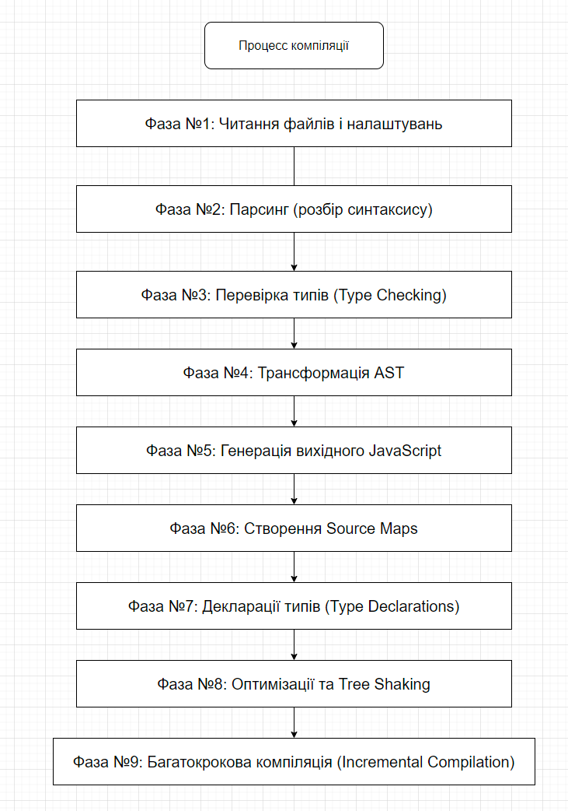

# Вступ до TypeScript 

**TypeScript (TS)** — це надбудова над JavaScript (JS), яка додає статичну типізацію. Це означає, що в TS ми можемо визначити тип даних, які змінна або функція повинні зберігати чи повертати, і якщо вони не відповідатимуть, компілятор видасть помилку ще до того, як ми запустимо код.

**Переваги TypeScript:**
1. Виявлення помилок на етапі написання коду: Це дозволяє уникнути багатьох проблем ще до запуску.
2. Краще автозаповнення (IntelliSense): TypeScript підказує, які методи чи властивості доступні, що допомагає швидше писати код.
3. Зрозумілість коду: Типізація робить код читабельнішим і легшим для розуміння, особливо у великих проєктах.

**Де використовується TypeScript?**

TypeScript застосовується всюди, де можна використовувати JavaScript: у веброзробці, бекенді (Node.js), мобільних додатках і навіть в розробці десктопних програм.

**Playground для TypeScript**

[TypeScript Playground](https://www.typescriptlang.org/play/) — це онлайн середовище, де можна швидко написати та протестувати код TypeScript. Це чудове місце для експериментів.

### Як працює TypeScript

#### Трансляція (компіляція) TypeScript в JavaScript
TypeScript не виконується в браузері або Node.js напряму. Він спочатку транслюється (компілюється) у звичайний JavaScript. Це означає, що будь-який TypeScript код зрештою перетворюється на стандартний JavaScript, який вже підтримується всіма сучасними браузерами та середовищами виконання (Node.js).

**Фаза 1: Читання файлів і налаштувань**



Приклад `tsconfig.json`:

```json
{
  "compilerOptions": {
    "target": "ES2020",
    "module": "commonjs",
    "strict": true,
    "esModuleInterop": true,
    "skipLibCheck": true,
    "forceConsistentCasingInFileNames": true
  },
  "include": ["src/**/*.ts"]
}
```
Більше деталей про конфігураційний [файл тут](https://www.typescriptlang.org/docs/handbook/tsconfig-json.html#handbook-content) 


**Фаза 2: Парсинг (розбір синтаксису)**

Після того, як всі файли та налаштування були зчитані, компілятор перетворює вихідний код у абстрактне синтаксичне дерево (AST).
[AST — це структура даних](https://habr.com/ru/companies/ruvds/articles/415269/), яка представляє логічну структуру вихідного коду. На цьому етапі код ще не перевіряється на помилки 
типів, а лише перетворюється в структуру, яку компілятор може аналізувати та оптимізувати.



Приклад:
```ts
let message: string = "Hello, TypeScript!";
```

Перетворюється в таке дерево (спрощено):
```php
Program
 ├─ VariableStatement
     ├─ VariableDeclaration
         ├─ Identifier (name: "message")
         ├─ TypeAnnotation (type: string)
         ├─ StringLiteral (value: "Hello, TypeScript!")
```

**3. Перевірка типів (Type Checking)**

TypeScript виконує перевірку типів після парсингу коду. Це основна фішка TypeScript, яка дозволяє виявляти помилки ще до 
виконання програми. На цьому етапі TypeScript перевіряє всі типи у вашому коді: типи змінних, аргументи функцій, повертальні значення та інше.



Якщо є проблеми з типізацією, компілятор виведе помилки. Наприклад:

```ts
let count: number = 42;
count = "Hello";  // Помилка: Type 'string' is not assignable to type 'number'.
```

**4. Трансформація AST**

Після того, як компілятор переконається, що код відповідає всім типам і не містить критичних помилок, AST починає перетворюватися в JavaScript код. Це важливий крок, який включає кілька підпроцесів:



Приклад перетворення сучасного коду в старіший JavaScript:
```ts
class Person {
  constructor(public name: string) {}
  greet() {
    console.log(`Hello, ${this.name}`);
  }
}
```

Перетворюється в ES5:
```js
var Person = /** @class */ (function () {
    function Person(name) {
        this.name = name;
    }
    Person.prototype.greet = function () {
        console.log("Hello, " + this.name);
    };
    return Person;
}());
```


**5. Генерація вихідного JavaScript**

Після того, як AST було перетворено на відповідні конструкції JavaScript, компілятор генерує JavaScript файли. Ці файли є вихідними і готові до виконання в середовищі виконання (наприклад, у браузері або Node.js).

Кожен файл TypeScript (`.ts`) зазвичай перетворюється на відповідний JavaScript файл (`.js`). Якщо у проєкті є налаштовані шляхи або системи модулів, TypeScript також належним чином організує ці файли.

**6. Створення Source Maps**

Під час компіляції TypeScript може також згенерувати source maps — файли, які допомагають відслідковувати відповідність між вихідним TypeScript кодом і скомпільованим JavaScript кодом. Це корисно для налагодження (debugging), коли ви можете переглядати TypeScript код у інструментах розробника браузера, навіть якщо фактично виконується JavaScript.

Source map дозволяє точно вказати, де у вихідному коді виникла помилка під час виконання JavaScript.

**7. Декларації типів (Type Declarations)**

TypeScript може згенерувати файли декларацій типів (файли з розширенням `.d.ts`), які описують типи змінних, функцій та інших конструкцій у проєкті, але не містять коду виконання. Ці файли корисні для спільного використання бібліотек і дозволяють іншим проєктам використовувати ваш код з перевіркою типів.

Наприклад, якщо ви розробляєте бібліотеку на TypeScript, ви можете згенерувати `.d.ts` файли, щоб розробники, які використовують вашу бібліотеку, могли скористатися перевагами перевірки типів навіть у тому випадку, якщо вони не використовують TypeScript.

```bash 
tsc --declaration
```
Ця команда генерує файли декларацій.

**8. Оптимізації та Tree Shaking**

Якщо проєкт використовує сучасні інструменти для зборки (наприклад, [Webpack](https://webpack.js.org/) або [Rollup](https://rollupjs.org/)), вони можуть виконати додаткові оптимізації, такі як tree shaking. Tree shaking дозволяє видаляти з вихідного JavaScript код, який не використовується в кінцевій програмі. TypeScript-компілятор спрощує цей процес, тому що він чітко визначає, які змінні або функції не використовуються через свою статичну типізацію.

**9. Багатокрокова компіляція (Incremental Compilation)**

TypeScript також підтримує інкрементальну компіляцію, коли лише змінені файли компілюються повторно. Це робить процес збірки значно швидшим у великих проєктах. Інкрементальна компіляція використовує файли кешу (`tsbuildinfo`), щоб відстежувати, які частини проєкту потрібно скомпілювати повторно.

#### Підсумок
Процес компіляції TypeScript складається з кількох ключових етапів: парсинг, перевірка типів, трансформація та генерація вихідного JavaScript коду. TypeScript забезпечує додаткову типізацію, яка допомагає розробникам уникати багатьох помилок на етапі розробки. Завдяки компіляції в JavaScript TypeScript сумісний із сучасними браузерами та середовищами виконання, такими як Node.js.


